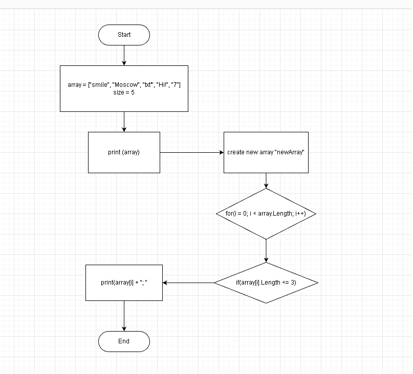

# Текстовое описание решения задачи

1. Создаем массив array из пяти строковых элементов.
2. Определяем функцию PrintArray, которая принимает массив в качестве аргумента и выводит его элементы на экран, разделенные точкой с запятой и заключенные в квадратные скобки.
3. Определяем функцию PrintNewArray, которая принимает массив в качестве аргумента, создает новый массив длиной 3 элемента, и выводит на экран только те элементы из исходного массива, длина которых не превышает 3 символа.
4. Вызываем функцию PrintArray, передавая ей массив array.
5. Вызываем функцию PrintNewArray, передавая ей массив array.

__*Алгоритм работы функции PrintNewArray:*__

1. Определяем новый пустой массив newArray длиной 3 элемента.
2. Проходим по элементам массива array с помощью цикла for.
3. Для каждого элемента проверяем его длину с помощью свойства Length и условия if.
4. Если длина элемента не превышает 3 символа, выводим его на экран, разделенный точкой с запятой, с помощью метода Console.Write.
5. После прохождения всех элементов массива array выводим закрывающую квадратную скобку на экран с помощью метода Console.WriteLine.

## Блок-схема задачи

Для наглядного примера описания действий используем блок-схему.

